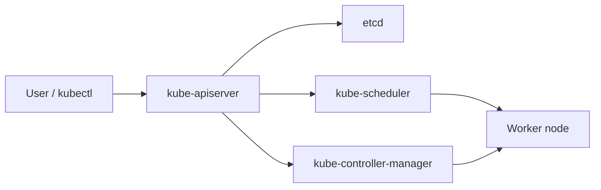

---

# Day 2: Control Plane & Node Architecture in Depth

---

*A Kubernetes cluster is a distributed system consisting of master nodes (the Control Plane) that manage system state and worker nodes that execute application processes.*

```
+---------------------------------------------------------------------------------+
|                                  CONTROL PLANE                                  |
|                                                                                 |
|   +-----------------------+                 +-------------------------------+   |
|   |                       |                 |                               |   |
|   |   kube-controller-    |                 |         kube-scheduler        |   |
|   |       manager         |                 |                               |   |
|   +-----------┬-----------+                 +---------------┬---------------+   |
|               │                                             │                   |
|               │            +─────────────────+              │                   |
|               └----------->|                 |<-------------┘                   |
|                            | kube-apiserver  |                                  |
|               ┌----------->|                 |<-------------┐                   |
|               │            +────────┬────────+              │                   |
|               │                     │                       │                   |
|   +-----------┴-----------+         │               +-------┴-------+           |
|   |                       |         ▼               |               |           |
|   |         etcd          |   (mTLS Engine)         |  Cloud-       |           |
|   |                       |                         |  Controller-  |           |
|   +-----------------------+                         |  Manager      |           |
|                                                     +---------------+           |
+-----------------------------------------┬---------------------------------------+
                                          │
                        (Secure Network Boundary / mTLS)
                                          │
+-----------------------------------------▼---------------------------------------+
|                                  WORKER NODE                                    |
|                                                                                 |
|   +-----------------------+  (CRI / gRPC)   +-------------------------------+   |
|   |        kubelet        |────────────────>|   Container Runtime           |   |
|   +-----------┬-----------+                 |   (containerd / CRI-O)        |   |
|               │                             +---------------+---------------+   |
|               │ (CNI / iptables)                            │                   |
|               ▼                                             ▼                   |
|   +-----------------------+                         +---------------+           |
|   |      kube-proxy       |                         |  Application  |           |
|   +-----------------------+                         |  Pods         |           |
|                                                     +---------------+           |
+---------------------------------------------------------------------------------+

```

1. Control Plane Internal Architecture
The Control Plane is responsible for making global architectural decisions, enforcing policies, and reacting to state drifts.

----

**A. `kube-apiserver` (The Stateless Gateway)**
The `k`ube-apiserver` is the structural hub of the entire cluster. It is the only component that interacts directly with the `etcd` backing store. No other component—neither the scheduler, the controllers, nor external users—can read or write directly to the database.

**Stateless Scaling:** Because the API server holds no local state, it can be horizontally scaled behind a standard Layer 4 or Layer 7 load balancer.

**The Request Pipeline:** When a request hits the API server, it traverses three sequential phases:

   - **Authentication:** Validates the identity of the caller using client certificates, bearer tokens, OpenID Connect (OIDC), or webhook verification.

   - **Authorization:** Evaluates whether the authenticated identity has sufficient clearance to execute the requested action. Evaluated via Role-Based Access Control (RBAC), Attribute-Based Access Control (ABAC), or Webhook modules.

   - **Admission Control:** A two-stage interception pipeline consisting of ***Mutating Admission Webhooks*** (which can modify incoming objects, such as injecting sidecar containers or applying default labels) and ***Validating Admission Webhooks*** (which perform schema enforcement and policy compliance checks, rejecting the request if validation fails).

   ```

         [ Incoming API Request ]
               │
               ▼
      [ API Handler ]
               │
               ▼
      [ Authentication & Authorization ]
               │
               ▼
      [ Mutating Admission Controller ] ──────────┐
               │                                  │ (Trigger)
               │                                  ▼
               │                        [ Registered Webhook ]
               │                                  │
               │                                  ▼
               │                        [ Modified Object ]
               │                                  │
               ◀──────────────────────────────────┘
               │
               ▼
      [ Object Schema Validation ]
               │
               ▼
      [ Validating Admission Controller ] ────────┐
               │                                  │ (Trigger)
               │                                  ▼
               │                        [ Registered Webhook ]
               │                                  │
               │                                  ▼
               │                        [ Validated Object ]
               │                                  │
               ◀──────────────────────────────────┘
               │
               ▼
      [ Persisted in etcd ]

   ```
 
   - API Handler: Receives the HTTP request and routes it to the correct internal function based on the API path.
   - Authentication & Authorization: Confirms who is making the request (AuthN) and whether they have the permissions (RBAC/AuthZ) to perform the requested action.
   - Mutating Admission Controller: Intercepts the request and can modify (mutate) the object before it is saved.
     - Webhook Loop: If external webhooks are registered, it sends the request out. The webhook returns a modified object, which is sent back into the pipeline.
   - Object Schema Validation: Ensures the incoming object (whether mutated or original) strictly matches the OpenAPI schema for that specific Kubernetes resource.
   - Validating Admission Controller: Performs complex, custom validations that go beyond simple schema checks (e.g., ensuring a namespace exists or enforcing resource quotas).
     - Webhook Loop: It can call external webhooks to approve or deny the request based on custom organizational policies.
   - etcd: If the request passes all checks and validations, the final desired state is persisted into the etcd key-value store, making it the official state of the cluster.

----

**B. `etcd` (The Distributed Key-Value Core)**
`etcd` is a strongly consistent, distributed key-value store that functions as the single source of truth for the entire cluster state.

**Raft Consensus Engine:** To maintain data integrity across a distributed cluster, `etcd` utilizes the Raft consensus protocol. Raft mandates that a majority (a quorum) of nodes must agree on a state change before it is committed to disk.

$$\text{Quorum} = \lfloor \frac{N}{2} \rfloor + 1$$
Consequently, production configurations require odd numbers of etcd members (typically 3 or 5) to survive node failures without incurring a split-brain scenario.

**Optimistic Concurrency Control (OCC):** `etcd` does not employ traditional database row locks. Instead, every resource object in Kubernetes contains a `metadata.resourceVersion` field mapped to the `etcd` modification revision counter. If two actors attempt to update the exact same resource simultaneously, the first write succeeds, incrementing the revision counter. The second write is immediately rejected with a `409 Conflict` error, forcing the second client to read the updated object and retry the operation.

*`etcd` operates as the cluster's single source of truth, managing state through a distributed, highly available consensus model.*

**Data Model & Storage:**

- *Distributed Key-Value Store:* Functions as a NoSQL database with no fixed schema, organizing data hierarchically.
- *Write-Ahead Log (WAL):* Ensures data durability. Every transaction is written to a local disk log before being applied to the database, allowing nodes to recover their exact state after a crash.
- *Communication:* Utilizes Protocol Buffers (protobuf) over gRPC for fast, serialized internal communication.

**Raft Consensus Algorithm:**

- *Node Roles:* Nodes operate as either a Leader, Follower, or Candidate.
- *Heartbeats:* The active Leader continuously sends heartbeats to Followers to report its health and maintain authority.
- *Elections:* If a Follower stops receiving heartbeats, it promotes itself to a Candidate and triggers an election to establish a new Leader.
- *Quorum:* Writes are only committed once a majority of nodes acknowledge the change.

**Security:**

- *Data Encryption:* By default, data in etcd (including Kubernetes Secrets) is stored unencrypted in plain text. Encryption at rest must be explicitly configured at the API server level.

 ```

   [ Kube API Server ]
            │
            │ 1. Write Request (e.g., "Create Pod X")
            ▼
   [ etcd Leader ] ────────────────────────────────────────┐
            │                                                │
            │ 2. Save to local WAL (Write-Ahead Log)         │
            │                                                │
            │ 3. Send Proposal                               │ 3. Send Proposal
            ▼                                                ▼
   [ etcd Follower 1 ]                              [ etcd Follower 2 ]
            │                                                │
            │ 4. Save to local WAL                           │ 4. Save to local WAL
            │                                                │
            │ 5. Send ACK (Acknowledgment)                   │ 5. Send ACK
            │                                                │
            └───────────────────────┬────────────────────────┘
                                    │
            ┌───────────────────────┘
            │
            ▼
   [ etcd Leader ]
            │
            │ 6. Quorum Reached (Majority has ACK'd)
            │ 7. Commit data to actual Database (State Machine)
            │ 8. Broadcast "Commit" command to Followers
            │ 9. Return "Success"
            ▼
   [ Kube API Server ]

 ```

   - *Request:* All write requests from the Kubernetes API server are routed to the current etcd Leader.
   - *Local WAL:* The Leader immediately writes the proposed change to its local disk (Write-Ahead Log) for crash recovery, but does not apply it to the database yet.
   - *Replication:* The Leader sends the proposed change to all Follower nodes.
   - *Follower WAL:* The Followers write the proposal to their own local logs.
   - *Acknowledgment:* Followers tell the Leader, "I have it safely on disk."
   - *Quorum:* The Leader waits until a strict majority (e.g., 2 out of 3 nodes) have acknowledged the write.
   - *Commit:* Once quorum is reached, the Leader permanently applies the change to its database.
   - *Finalize:* The Leader tells the API server the write was successful, and asynchronously tells the Followers they can now apply the change to their databases too.

 ```

      [ etcd Leader ] ◄─────── (Continuously broadcasts Heartbeats) ───────┐
               │                                                             │
               │ Heartbeats say: "I am alive, do not hold an election"       │
               ▼                                                             ▼
      [ etcd Follower 1 ]                                           [ etcd Follower 2 ]
               │                                                             │
               │ (Leader crashes or network drops)                           │
               ▼                                                             ▼
      [ Heartbeat Timeout! ]                                        [ Heartbeat Timeout! ]
               │                                                             │
               │ (Converts to Candidate)                                     │
               ▼                                                             │
         [ Candidate ] ────────── (Requests Votes) ──────────────────────────▶
               │                                                             │
               │ ◄────────────────────── (Grants Vote) ──────────────────────┤
               ▼
      [ New Leader Elected ] ── (Starts sending Heartbeats) ───────────────▶

 ```
   - *Steady State:* The cluster is peaceful as long as Followers receive frequent heartbeats (usually every 100ms) from the Leader.
   - *Timeout:* Every Follower has a randomized countdown timer. If the timer hits zero before a heartbeat arrives, it assumes the Leader is dead.
   - *Election:* The Follower promotes itself to a Candidate, votes for itself, and asks the others for their votes.
   - *Resolution:* Because timers are randomized, usually one node times out first, gets the majority of votes, and becomes the new Leader, instantly suppressing other candidates with a new heartbeat.


----

**C. `kube-scheduler` (The Placement Engine)**
The scheduler is a highly specialized loop that searches for newly instantiated Pods that possess a blank `spec.nodeName` attribute and determines the optimal host node for them.

The scheduling cycle operates via a two-phase architecture:

**Filtering (Predicates):** Evaluates nodes against strict architectural constraints. Nodes are eliminated if they have insufficient allocatable memory/CPU, if their ports are already bound, or if they violate defined node selectors or taints.

**Scoring (Priorities):** Assigns a score ranging from 0 to 10 to the nodes that survived the filtering phase. The scheduler uses pre-configured algorithms (e.g., balancing resource utilization across the cluster, prioritizing topology distributions, or honoring affinity rules). The node with the highest aggregate score is chosen. The scheduler then performs a ***Binding*** operation, sending a request to the API server to populate the Pod's `spec.nodeName` attribute.

  ```

  [ Pod Queue ] ──(Sort)──▶ [ Next Pod to Schedule ]

   ================ SCHEDULING CYCLE (Synchronous) ================
   │
   ├─▶ [ PreFilter ]      (Setup & check pod requirements)
   ├─▶ [ Filter ]         (Eliminate nodes that cannot run the pod)
   │      └─▶ [ PostFilter ] (Triggered ONLY if no nodes fit: handles Preemption)
   │
   ├─▶ [ PreScore ]       (Prepare shared state for scoring plugins)
   ├─▶ [ Score ]          (Rank the remaining valid nodes based on metrics)
   ├─▶ [ Normalize ]      (Scale scores to a standard 0-100 range)
   │
   ├─▶ [ Reserve ]        (Temporarily claim resources on the winning node)
   └─▶ [ Permit ]         (Approve, deny, or wait for external conditions)
          │
          ▼
   ================== BINDING CYCLE (Asynchronous) ==================
          │
          ├─▶ [ PreBind ]  (Execute prerequisites, e.g., attach network volumes)
          ├─▶ [ Bind ]     (Assign the pod to the node via the API server/etcd)
          └─▶ [ PostBind ] (Informational cleanup and logging)

  ```

  1. The Scheduling Cycle
This cycle is synchronous and evaluates one pod at a time. If the pod fails at any point in this cycle (e.g., no nodes have enough RAM), the cycle aborts, and the pod is sent back to the queue.

  - `Sort` / `Queueing`: Determines which pod in the queue should be evaluated next based on priority classes.

  - `Filter` (The "Can it fit?" phase): Hard constraints. It checks things like node resources (CPU/Memory), nodeSelectors, and Taints/Tolerations. Nodes that fail are immediately dropped from consideration.

  - `Post-Filter` (Preemption): If the Filter phase leaves zero available nodes, this phase kicks in. It looks for lower-priority pods it can evict to make room for the pending high-priority pod.

  - `Score` (The "Which is best?" phase): Soft constraints. It grades the remaining valid nodes. For example, a node with the lowest current resource utilization might get a high score, while a heavily loaded node gets a low score.

  - `Reserve` & `Permit`: The scheduler assumes the pod will go to the highest-scoring node and reserves those resources in its internal cache so the next pod in the queue doesn't accidentally claim them.

  2. The Binding Cycle
  Once the scheduler selects a node, it moves to the Binding Cycle. This cycle is asynchronous, meaning the scheduler can immediately start evaluating the next pod in the queue while the current pod finishes binding in the background.

  - `PreBind`: Performs any necessary work before the pod is officially bound, such as provisioning a persistent storage volume.

  - `Bind`: The actual API call to the Kubernetes API Server, writing the assignment into etcd (e.g., updating the Pod spec so nodeName = worker-node-1).

  - `PostBind`: A purely informational phase used for logging, metrics, or cleaning up internal scheduler state.

---
**D. `kube-controller-manager` (The Reconciliation Core)**
A monolithic binary containing a collection of independent, distinct control loops. Each controller runs in an infinite loop, utilizing the API server's ***Watch API*** to receive real-time streams of resource alterations.

**ReplicaSet Controller:** Continuously counts the active pods matching a specific label selector. If the count falls short of the desired target, it tells the API server to create new Pod objects.

**Node Lifecycle Controller:** Monitors node heartbeats. If a worker node goes silent for longer than the defined eviction timeout, the controller marks the node as unhealthy and schedules its workloads onto alternative nodes.

**E. `cloud-controller-manager`**
Decouples cloud-provider-specific logic from the core Kubernetes codebase. It interacts with cloud infrastructure APIs to manage external load balancers, provision persistent storage routing, and handle node lifecycles natively within environments like AWS, GCP, or Azure.

2. Worker Node Internal Architecture
Worker nodes are the computational units responsible for executing the isolated workload processes assigned by the Control Plane.

**A. `kubelet` (The Node Supervisor)**
The primary agent running on every worker node. It does not look at manifests on your local laptop; it watches the API Server for Pod specifications assigned specifically to its local machine's hostname.

**The Synchronization Loop:** The `kubelet` continuously queries the API Server for assigned Pod definitions. Upon detecting a new assignment, it calls the local high-level container runtime using the standard gRPC ***Container Runtime Interface (CRI)*** to manifest the physical container processes.

**Health Surveillance:** The `kubelet` is directly responsible for monitoring container execution states and executing defined liveness, readiness, and startup probes locally.

**B. `kube-proxy` (The Network Virtualization Layer)**
Runs on every node and maintains the network architecture required to route traffic to internal Pod endpoints. It acts as a local routing table manager.

**iptables Mode:** `kube-proxy` watches the API server for changes to Service and Endpoint objects. It translates these abstractions into standard Linux kernel `iptables` packet-filtering rules. When traffic hits a Service IP, the kernel performs DNAT (Destination Network Address Translation), randomly selecting a backend Pod endpoint. This mode can suffer from performance degradation in massive clusters, as `iptables` evaluates rules linearly ($O(N)$ lookup complexity).

**IPVS (IP Virtual Server) Mode:** A highly optimized alternative built into the Netfilter framework. IPVS utilizes hash tables ($O(1)$ lookup complexity), allowing it to handle massive connection loads and tens of thousands of services without incurring significant kernel latency overhead.

3. Cluster Security: Secure Communication via Mutual TLS (mTLS)
Every single structural boundary within the Kubernetes architecture is secured by default using ***Mutual TLS (mTLS)***. Components do not simply encrypt their traffic; they must explicitly present cryptographic identities to one another.

```

                  [ Root Certificate Authority (CA) ]
                                   │
         ┌─────────────────────────┼─────────────────────────┐
         ▼                         ▼                         ▼
   (Signed Cert)             (Signed Cert)             (Signed Cert)
┌─────────────────┐       ┌─────────────────┐       ┌─────────────────┐
│ kube-apiserver  │       │     kubelet     │       │ kube-scheduler  │
└────────┬────────┘       └────────┬────────┘       └────────┬────────┘
         │                         │                         │
         └───────── mTLS ──────────┴───────── mTLS ──────────┘

```

**The Cluster Certificate Authority (CA):** During cluster provisioning, a dedicated root CA certificate and private key pair are established. All discrete components (API Server, Kubelet, Scheduler, Controller Manager) are issued specific client/server certificates cryptographically signed by this central root CA.

**Authentication & Authorization Enforcements:** When the `kubelet` connects to the `kube-apiserver`, the API server verifies that the kubelet's certificate was signed by the cluster CA, reads the Common Name (CN) to identify the specific node, and enforces Role-Based Access Control before fulfilling any data requests.

### 4. Scheduling Fundamentals: Labels, Selectors, and Placement Rules

The scheduler does not just choose a random node. It makes placement decisions based on several signals that are important in real clusters.

- **Labels and Selectors:** Labels attach metadata to objects such as nodes and pods. Selectors let controllers and services target only the objects that match specific labels.
- **Namespaces:** Kubernetes namespaces provide logical separation for resources like deployments, services, and config. They are helpful for organization and multi-team isolation, although they are not the same as full security boundaries.
- **Taints and Tolerations:** A taint marks a node so that certain pods are discouraged or prevented from landing there. A toleration allows a pod to accept that taint.
- **Affinity and Anti-Affinity:** Affinity rules encourage pods to run close to each other, while anti-affinity rules keep them apart for resiliency or topology awareness.
- **Resource Requests and Limits:** The scheduler uses CPU and memory requests to decide if a node has enough capacity. Limits prevent a single workload from consuming all available resources.

These scheduling concepts are what transform Kubernetes from a simple runtime into a policy-driven platform.

### Architecture Flow: Control Plane to Worker Node


Example:
- When you create a Pod, the API server stores the object in etcd.
- The scheduler chooses a node based on capacity, labels, taints, and affinity rules.

### Quick Summary
- The control plane makes global decisions.
- Worker nodes run the workloads.
- kubelet, kube-proxy, and the container runtime are essential node components.

### Key Commands
- `kubectl get nodes`
- `kubectl describe node <node-name>`
- `kubectl get pods -A`

---
