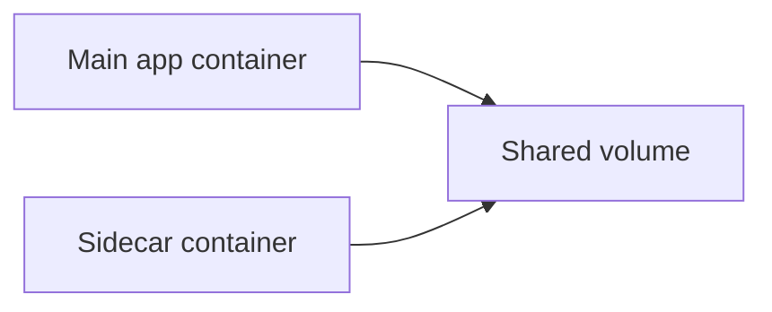

---

# Day 3: Pod Internals, Container Topologies, and Advanced Execution Modes

---

*The Pod is the foundational building block of the Kubernetes resource hierarchy. You never deploy individual containers directly into a cluster; you always embed them within a Pod context.*

1. The Anatomy of a Pod
A Pod is a logical deployment wrapper that hosts one or more closely coupled containers. The structural superpower of a Pod is that all containers residing within it share a set of identical Linux namespaces.

A. The Infrastructure ("Pause") Container
When a Pod is scheduled onto a node, the container runtime does not immediately start your application container. It first provisions an internal infrastructure container known as the Pause Container (k8s.gcr.io/pause).

The pause container's sole responsibility is to acquire a set of Linux namespaces from the kernel (net, ipc, uts, mnt) and then go to sleep. When your actual application containers are subsequently launched, they are instructed to join the exact namespaces already held open by the pause container.

B. Structural Consequences of Shared Namespaces
Network Cohabitation: Every container within a single Pod shares an identical net namespace. They share the same IP address, routing table, and port space. If Container A binds to port 8080, Container B can connect to it directly via localhost:8080. Conversely, Container B cannot bind to port 8080, or it will throw a port-in-use error.

Shared Volume Space: Containers inside the same Pod share the same storage volume declarations. By mounting a localized emptyDir volume, separate containers can read and write to the exact same directory structure at native memory speeds.

2. Multi-Container Topologies
While the vast majority of production Pods follow a single-container pattern, multi-container topologies are critical for cross-cutting architectural concerns.

A. The Sidecar Pattern
An auxiliary container that enhances or extends the functionality of the primary application container without modifying the application's core codebase.

Production Example: A primary web application writes access logs to a local disk directory. A sidecar container (like a Filebeat or Fluentbit agent) runs concurrently in the same Pod, tailing that exact log directory and streaming the entries out to a centralized elasticsearch cluster.

B. The Ambassador Pattern
An explicit proxy container that abstracts away complex networking connectivity concerns for the primary container.

Production Example: A legacy application container needs to read and write to a highly distributed, sharded database architecture. An ambassador container running Envoy can be embedded alongside the application. The application simply connects to localhost:5432, and the ambassador handles the complex database routing, circuit breaking, and retry logic transparently.

C. The Adapter Pattern
Standardizes the output or metrics interfaces of heterogeneous application environments.

Production Example: You possess multiple legacy services that export application performance metrics in entirely different text formats. An adapter container can be deployed inside the Pod to consume these raw outputs, transform them into standard Prometheus exposition formats, and present a uniform /metrics endpoint to the cluster scraping infrastructure.

3. Specialized Container Execution Classifications
A. Init Containers
Init Containers run sequentially to completion before any of the primary application containers are allowed to initialize. If an init container fails, the kubelet restarts the entire Pod loop until the init container terminates with an explicit Exit Code 0.

Use Cases: Performing heavy database schema migrations, executing complex configuration generation scripts, or performing blocking checks to guarantee that external dependency systems (like a backend API or message broker) are fully available online before launching the main app.

Resource Calculations: The effective resource requests/limits of a Pod are calculated as the maximum of the resource requests of the init containers versus the sum of the requests of the main application containers, because init containers and application containers never run concurrently.

B. Ephemeral Containers (Advanced Troubleshooting)
A major challenge in secure production environments is that container images are stripped of all diagnostic tools (shell, curl, iproute2) to minimize the attack surface. If a stripped container enters an unstable state or deadlocks, engineers cannot easily debug it.

Ephemeral Containers solve this. They are injected dynamically into an already active, running Pod using the specialized kubectl debug API.

Mechanism: The ephemeral container is injected directly into the namespaces of the target Pod, allowing an engineer to run diagnostic utilities against the active application processes, memory spaces, and network interfaces without restarting or modifying the original container environment.

4. Pod Lifecycle, Restart Policies, and Termination Behavior
A Pod does not exist forever in a single state. It moves through a lifecycle that is important for troubleshooting and operational safety.

A. Pod Phases and Container States
- **Pending:** The Pod has been accepted by the cluster but is still waiting for scheduling or image pulls.
- **Running:** At least one main container is running.
- **Succeeded:** A job-like workload completed successfully.
- **Failed:** A container terminated with an error.
- **Unknown:** The Pod state cannot be determined, usually due to a communication issue with the node.

Containers inside a Pod also have states such as `Waiting`, `Running`, and `Terminated`, and Kubernetes may report reasons such as `CrashLoopBackOff` or `ImagePullBackOff`.

B. Restart Policies
The `restartPolicy` field controls how the kubelet responds when a container exits:
- **Always**: The default for regular Pods; restarts containers automatically.
- **OnFailure**: Restarts only when the container exits with a non-zero code.
- **Never**: Never restarts the container automatically.

C. Graceful Shutdown and Termination Signals
When a Pod is deleted, Kubernetes sends a `SIGTERM` to the main process and gives it a grace period before forcefully killing it with `SIGKILL`. This allows applications to finish in-flight work and shut down cleanly.

D. PreStop Hooks
A `preStop` hook can run a command or HTTP request before the container is terminated, which is useful for draining traffic or flushing buffers.

5. Volumes and Storage Basics
Pods are ephemeral, so any data written to the container filesystem alone is lost when the container or Pod is replaced. Volumes solve this problem by providing persistent or shared storage paths.

- **emptyDir:** Temporary storage shared by containers in the same Pod. It exists only while the Pod is alive.
- **hostPath:** Mounts a file or directory from the node's filesystem. It is useful for node-specific debugging but is not portable.
- **PersistentVolume (PV) and PersistentVolumeClaim (PVC):** A higher-level storage abstraction where storage is provisioned and consumed independently of the Pod lifecycle.
- **CSI Drivers:** Kubernetes uses Container Storage Interface (CSI) drivers to integrate with cloud and network storage systems such as AWS EBS, Azure Disk, or NFS.

### Practical Example: Sidecar Pattern

Example:
- The app writes logs to a shared directory.
- The sidecar tails those logs and forwards them to a logging system.

### Quick Summary
- Pods are the smallest deployable unit.
- Containers in the same Pod share network and storage context.
- Sidecars, init containers, and ephemeral containers solve different operational needs.

### Key Commands
- `kubectl get pods`
- `kubectl describe pod <pod-name>`
- `kubectl logs <pod-name>`

---