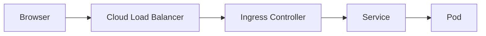

---

# Day 6: Edge Traffic Architecture & Ingress Control

---

*Managing traffic entering the cluster requires routing external requests through a centralized ingress controller rather than creating individual, expensive cloud load balancers for every internal application service.*

```
[ External Client Request ]
           │
           ▼
┌────────────────────────────────────────┐
│ Cloud / External Load Balancer         │
└──────────┬─────────────────────────────┘
           │ (Passes Traffic to Cluster Node Interface)
           ▼
┌────────────────────────────────────────┐
│ Ingress Controller (e.g., NGINX Pod)   │
│ ┌────────────────────────────────────┐ │
│ │ Dissects HTTP/HTTPS Header Paths   │ │
│ └──────────────────┬─────────────────┘ │
└────────────────────┼───────────────────┘
                     ├──────────────────────────────────────┐
                     ▼ (Bypasses Kube-Proxy Service IP)     ▼
            [ Application Pod A ]                  [ Application Pod B ]

```

1. The Ingress Model vs. Services
While a LoadBalancer service type creates an isolated, unique structural load balancer per application, an Ingress is an API object that manages a unified reverse-proxy configuration. It consolidates multiple routing paths under a single external entry point.

2. Ingress Controllers Deep Dive
The Ingress object is merely a set of routing definitions stored as data in etcd. It does nothing on its own. To route traffic, the cluster must run an active Ingress Controller (e.g., NGINX Ingress Controller, Traefik, HAProxy, Envoy).

The Internal Mechanics
An Ingress Controller is an application (typically a highly optimized proxy like NGINX) running inside a standard K8s Pod.

The Ingress Controller runs a control loop that watches the API server for Ingress objects.

When an Ingress rule is added or updated (e.g., route traffic for api.company.com/v1 to the internal service api-service), the controller parses the manifest.

It bypasses traditional kube-proxy service routing entirely to reduce latency. Instead, it queries the API server for the exact individual backend IP addresses matching the service (Endpoints) and injects those raw IP addresses directly into its internal proxy configuration file (e.g., rewriting the NGINX upstream block).

It dynamically reloads its proxy configuration in memory, ready to route live traffic.


3. Cryptographic Operations: TLS Termination and Cert-Manager
Ingress controllers act as the termination point for SSL/TLS connections to minimize the processing overhead on backend application pods.

Secret Association: You upload your domain's private key and X.509 certificate as a K8s Secret. The Ingress manifest references this Secret in its tls configuration block. The Ingress controller reads the keys and handles the cryptographic handshake with the client.

Automated Lifecycle Management via Cert-Manager: In production, manually renewing certificates is an operational risk. Cert-Manager runs as an internal controller that extends the K8s API. It watches Ingress objects for specific annotations. If a new domain is detected, Cert-Manager automates the validation process with a Certificate Authority (like Let's Encrypt) using ACME protocols (HTTP-01 or DNS-01 challenges), issues the valid certificate, saves it as a Secret, and handles renewals automatically before expiration.

4. Ingress Routing Patterns and Troubleshooting
Ingress is often the first place where traffic issues become visible, so understanding common patterns is important.

A. Path-Based and Host-Based Routing
Ingress can route requests based on the URL path or the Host header. For example, one Ingress can forward `api.example.com` to an API service and `www.example.com` to a frontend service.

B. Rewrites and Backend Configuration
Some controllers support URL rewrites or custom annotations to adjust how traffic is forwarded to backend services. This is useful when the application expects a different path structure than the external URL.

C. Common Troubleshooting Checks
- Confirm that the Ingress controller pod is running and ready.
- Verify that the backend Service exists and has healthy endpoints.
- Check whether the Ingress resource has a valid host and path definition.
- Inspect controller logs when traffic is failing or certificates are not being issued.

5. Ingress vs. External Load Balancers
An Ingress is not a replacement for every load balancer. It is best for HTTP and HTTPS routing at the application layer, while a cloud load balancer is still needed to expose the ingress controller itself to the public internet.

### Request Path: Ingress to Service


Example:
- `api.example.com` can route to an API service.
- `www.example.com` can route to the frontend service.

### Quick Summary
- Services expose pods internally.
- Ingress provides external HTTP and HTTPS routing.
- TLS termination and certificates are usually handled at the ingress layer.

### Key Commands
- `kubectl get ingress`
- `kubectl describe ingress <name>`
- `kubectl get svc`

---