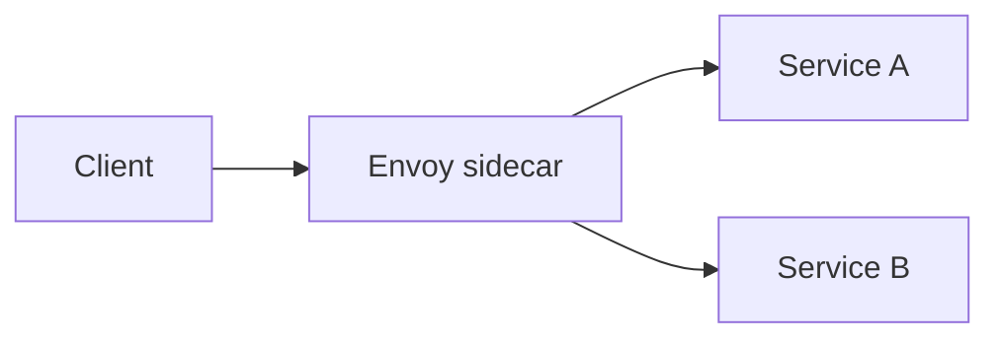

---

# Day 8: Service Mesh Architecture & eBPF Core Mechanics

---

*As microservice scale increases, managing security policies, traffic routing, and tracking network latency exclusively within application code becomes unmanageable.*


1. Service Mesh Topologies
A Service Mesh is a dedicated infrastructure layer built directly into the network fabric to manage service-to-service communication, security authentication, and comprehensive telemetry generation.

A. Sidecar Proxy Architecture (Classic Mesh - e.g., Istio, Linkerd)
Every application Pod is injected with an auxiliary network proxy container (typically Envoy) running alongside the primary application process.

Traffic Interception: The service mesh modifies the local Pod's network routing tables (iptables) during initialization. Any traffic entering or exiting the Pod is transparently intercepted and routed through the local proxy container.

The Control Plane vs. Data Plane Split: The Data Plane consists of these distributed sidecar proxies that handle actual application network traffic. The Control Plane (e.g., Istio's istiod) manages configuration distribution, issuing security keys, routing policies, and cryptographic certificates down to the active proxies.

B. Ambient Mesh Architecture (Sidecarless)
Injecting a proxy container into every single Pod adds memory overhead and increases network latency. Modern meshes support a Sidecarless architecture:

ZTUN (Zero-Trust Tunnel): A lightweight shared network proxy runs on every node, handling low-level Layer 4 mTLS transportation and traffic routing securely.

Waypoint Proxies: If complex Layer 7 logic is required (e.g., HTTP header manipulation or path-based routing), traffic is forwarded to a dedicated out-of-process proxy instance that runs independently of the application pods.


2. eBPF (Extended Berkeley Packet Filter) Mechanics
eBPF is a revolutionary Linux kernel feature that allows engineers to execute sandboxed code directly inside the secure context of the operating system kernel without modifying the kernel source code or loading external kernel modules.

```

       [ Application Layer: Pod A ]      [ Application Layer: Pod B ]
                    │                                 ▲
                    │ (Bypasses iptables Stack)        │
────────────────────┼─────────────────────────────────┼────────────────────
                    ▼                                 │
  [ LINUX KERNEL SPACE ]                              │
  ┌───────────────────────────────────────────────────┴─────────────────┐
  │  eBPF Network Program (e.g., Cilium CNI Engine)                     │
  │  - Intercepts sockets directly at the kernel layer                  │
  │  - Routes packets via efficient memory maps                         │
  └─────────────────────────────────────────────────────────────────────┘

```

Changing the CNI Paradigm (Bypassing iptables)
Traditional Kubernetes network plugins (CNIs) rely heavily on Netfilter and iptables to route network traffic between pods. As noted on Day 2, iptables rules must be evaluated sequentially. In a massive cluster with thousands of active endpoints, every network packet must traverse an enormous list of rules, introducing significant CPU overhead and latency.

CNIs like Cilium use eBPF to completely bypass the standard iptables network stack:

When a Pod creates a network socket connection, an eBPF program intercepts the operation directly at the Linux kernel socket layer (sockmap).

Because the kernel already knows the exact destination socket of the target backend Pod, the eBPF program copies the network packet data directly from the source socket memory buffer to the destination socket memory buffer.

This completely eliminates the overhead of network packet encapsulation, routing table lookups, and firewall rule evaluations, enabling near-native bare-metal packet switching speeds.

3. Service Mesh Operations and Troubleshooting
A service mesh adds powerful capabilities, but it also adds a layer that can fail or misbehave.

A. Why Service Meshes Matter
They provide consistent mTLS, traffic policies, retries, circuit breaking, and metrics collection without forcing each application team to reimplement these concerns in code.

B. Common Service Mesh Issues
- Sidecar startup or readiness failures
- Certificate issuance or rotation problems
- Traffic not reaching the intended backend
- High proxy CPU or memory usage
- Unexpected latency introduced by retries or retries loops

C. Debugging Approach
- Check the health of the control plane and data plane components.
- Inspect proxy logs and configuration status.
- Validate mTLS policies and destination rules.
- Confirm that application ports and service selectors match the intended traffic path.

4. eBPF and Service Mesh as a Platform Shift
eBPF and modern service mesh designs move networking and observability closer to the kernel and the platform layer. This reduces overhead and improves visibility, making large-scale distributed systems easier to secure and operate.

### Example: Service Mesh Traffic Flow


Example:
- Requests are intercepted and observed by the proxy.
- mTLS and retries can be enforced centrally without changing application code.

### Quick Summary
- Service meshes add policy, observability, and security to service-to-service traffic.
- Sidecars and ambient modes are two common approaches.
- eBPF improves networking efficiency at the kernel level.

### Key Commands
- `kubectl get pods -n istio-system`
- `kubectl logs -n istio-system <pod-name>`
- `kubectl get svc`

---
