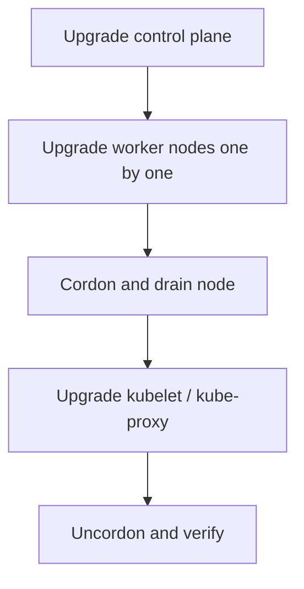

---

# Day 10: Cluster Lifecycles, Upgrades, & Performance Benchmarking

---

*Clusters are long-lived environments that require regular maintenance, version upgrades, and performance validation to remain secure and performant.*

1. Node Maintenance: Cordon and Drain Mechanics
When you need to perform maintenance on a physical worker node (e.g., upgrading the host OS kernel or replacing hardware components), you must safely remove all active workloads from that machine without disrupting users.

Step 1: Cordon
```
kubectl cordon <node-name>
```
Action: Marks the target node as Unschedulable by updating the node object's spec.unschedulable property to true.

Effect: The kube-scheduler will immediately ignore this node during future filtering cycles. However, any pods currently running on the node remain untouched and continue to execute.

Step 2: Drain
```
kubectl drain <node-name> --ignore-daemonsets --delete-emptydir-data
```

Action: Triggers a graceful eviction phase for all active workloads residing on the cordoned node.

Effect: The API server sends a termination signal (SIGTERM) to the pods on the node. The matching workload controllers (Deployments, StatefulSets) detect the loss of these active replicas and automatically schedule replacement pods onto alternative healthy nodes across the cluster.

The DaemonSet Exception: Pods managed by a DaemonSet ignore standard scheduling rules to run an instance on every node. The --ignore-daemonsets flag tells the drain operation to ignore them, as they will be automatically destroyed when the underlying node machine is shut down.


2. Zero-Downtime Cluster Upgrade Protocols
Kubernetes introduces new minor versions regularly, and production environments must be upgraded systematically to maintain compatibility and security. You must never skip major or minor versions consecutively (e.g., upgrading directly from v1.28 to v1.31 is unsupported; you must step sequentially through 1.29 and 1.30).

```
[ Step 1: Primary Control Plane Upgrade ]
Upgrade: kube-apiserver ──► etcd ──► kube-controller-manager ──► kube-scheduler
Note: Workers remain operational during this phase.
                          │
                          ▼
[ Step 2: Secondary Control Plane Upgrade ]
Upgrade secondary control plane instances to match the new version.
                          │
                          ▼
[ Step 3: Rolling Node Pool Upgrades ]
For each Worker Node:
  Cordon Node ──► Drain Node ──► Upgrade Kubelet/kube-proxy ──► Uncordon Node
The Infallible Sequential Execution Order

```

   1. Upgrade the Primary Control Plane Components
Always upgrade the master node management components first using your cluster deployment tool (e.g., kubeadm). The components must be upgraded in a strict sequence:
   - `kube-apiserver`: The API server must be upgraded first because it maintains backward compatibility with older components (typically up to two minor versions behind), allowing older worker node kubelets to continue communicating with it during the transition.
   - `etcd` (if upgraded in tandem).
   - `kube-controller-manager` and `kube-scheduler`.

   2. Upgrade Additional Control Plane Nodes
If running a high-availability control plane topology, proceed to upgrade the remaining master nodes to bring them up to parity with the primary instance.

   3. Upgrade Worker Nodes (Rolling Node Pool Update)
Upgrade worker nodes sequentially one by one using the Cordon and Drain workflow:
   - Execute a cordon and drain on the target worker node to safely evict active workloads.
   - Upgrade the node's local component packages: the kubeadm utility, the network traffic cop kube-proxy, and the node agent kubelet.
   - Restart the kubelet system service to load the new version.
   - Execute an uncordon on the node to restore it to active duty, allowing the scheduler to place workloads onto it once again. Repeat this lifecycle across the remaining worker nodes.

3. Cluster Performance Benchmarking
To ensure a cluster can handle production loads, you must benchmark its performance under artificial stress to identify architectural bottlenecks.

API Server Stress Testing: Using utilities like clusterloader2, you simulate massive write and read loads against the kube-apiserver by rapidly creating, listing, and destroying thousands of dummy objects. This test measures the latency distribution of API requests and validates that control plane performance remains stable under load.

Network Performance Validation: Using benchmarking engines like iperf3 or netperf deployed within test container pods, you measure the true network throughput and packet latency between different worker nodes, different namespaces, and across various network access policies. This allows you to measure the latency overhead introduced by your CNI implementation or service mesh proxy layers.

4. Backup, Recovery, and Upgrade Readiness
Operational maturity requires planning for failures, not only for steady-state performance.

A. Backup Strategy
For a Kubernetes cluster, backups should include etcd snapshots and any required application data. A restore plan must be tested regularly so that the platform team can recover quickly from control plane or data loss events.

B. Upgrade Readiness Checks
Before an upgrade, verify that the current cluster version is supported, that all add-ons are compatible, that node capacity is sufficient, and that the control plane has enough quorum to tolerate a failure during the rollout.

C. Rollback Planning
If an upgrade or change causes regressions, the team should know how to revert the change quickly, whether that means rolling back a deployment, restoring from a backup, or reapplying a previous configuration.

### Example: Upgrade Workflow


Example:
- A cluster upgrade is done gradually to avoid downtime.
- Rollbacks are planned before the change is applied.

### Quick Summary
- Maintenance uses cordon and drain to safely move workloads.
- Upgrades must follow a controlled sequence.
- Backup and recovery plans are essential for production clusters.

### Key Commands
- `kubectl cordon <node-name>`
- `kubectl drain <node-name> --ignore-daemonsets`
- `kubectl uncordon <node-name>`

---
---