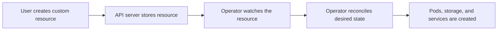

---

# Day 13: Extending the Kubernetes Control Plane (Super Advanced)

---

*The true power of Kubernetes is its extensibility. You can extend the platform beyond its native APIs to turn it into a custom internal cloud operating system tailored specifically to your organizational requirements.*

1. Custom Resource Definitions (CRDs)
Kubernetes includes built-in APIs for standard objects like Pods and Services. A Custom Resource Definition (CRD) allows you to extend the cluster's capabilities by defining your own entirely new API objects.

```
---

apiVersion: apiextensions.k8s.io/v1
kind: CustomResourceDefinition
metadata:
  name: postgresclusters.database.company.com
spec:
  group: database.company.com
  versions:
    - name: v1alpha1
      served: true
      storage: true
      schema:
        openAPIV3Schema:
          type: object
          properties:
            spec:
              type: object
              properties:
                storageSize:
                  type: string
                replicaCount:
                  type: integer
  scope: Namespaced
  names:
    plural: postgresclusters
    singular: postgrescluster
    kind: PostgresCluster

```

When this CRD manifest is submitted to the cluster, the kube-apiserver registers the new schema definition. Developers can now write and submit standard YAML manifests for this entirely custom resource type:

```
---

apiVersion: database.company.com/v1alpha1
kind: PostgresCluster
metadata:
  name: prod-analytics-db
spec:
  storageSize: "500Gi"
  replicaCount: 3

```

2. The Operator Pattern & Custom Controllers
A CRD on its own is just static data sitting inside the etcd database. The kube-apiserver understands the schema, but it doesn't know what to do with a PostgresCluster object. To make the CRD functional, you must build an accompanying Custom Controller.

This combination of a custom resource definition paired with a custom reconciliation controller is known as the Operator Pattern.

```

[ Developer submits Custom Manifest ]
                 │
                 ▼
 ┌──────────────────────────────────────────────┐
 │ kube-apiserver (Saves Object to etcd Core)   │
 └───────────────┬──────────────────────────────┘
                 │
                 ▼ (Watch API Stream)
 ┌──────────────────────────────────────────────┐
 │ Custom Operator Binary (Go/Kubebuilder Loop) │
 │  ┌────────────────────────────────────────┐  │
 │  │ Reconcile Loop: Detects new DB Object  │  │
 │  └────────────────┬───────────────────────┘  │
 └───────────────────┼──────────────────────────┘
                     ▼ (Automated Actions Executed via Operator Code)
┌────────────────────────────────────────────────────────────────────────┐
│ Provisions 3 StatefulSet Pods ──► Sets up WAL Replication ──► Backups  │
└────────────────────────────────────────────────────────────────────────┘

```

The Internal Execution Loop of an Operator
The custom operator binary is written in languages like Go (typically utilizing frameworks like Kubebuilder or the Operator SDK). It runs inside a standard Pod within the cluster.

The operator establishes a continuous Watch stream with the kube-apiserver, listening specifically for events involving your custom resource type (PostgresCluster).

When a user creates a new PostgresCluster manifest requesting 3 replicas and 500GB of storage, the operator intercepts the event and triggers its internal Reconcile Loop.

Inside this loop, you write domain-specific software logic that automates complex operational workflows:

The operator code automatically generates an underlying StatefulSet with the correct storage layouts.

It initiates network connections to configure master-slave replication configurations across the database nodes.

It sets up automated backup schedules with external storage bucket systems.

If a database instance breaks or experiences configuration drift, the operator catches the variation within its reconciliation loop and repairs the database state automatically without requiring human intervention.

3. The Aggregated API Layer
For ultra-advanced use cases where standard CRD functionality is insufficient, you can extend the platform using the Aggregated API Layer.

Instead of storing custom definitions within the cluster's main etcd database, you write and deploy a completely independent, standalone API Server binary running its own isolated backend storage engine.

You submit an APIService registration manifest to the core Control Plane. When a client makes a request to the main kube-apiserver targeting your custom API path, the primary server routes the connection down to your custom API server extension transparently. This pattern is utilized by high-throughput components like the core Kubernetes Metrics Server, ensuring massive volumes of real-time metrics data do not overload the primary cluster state store.

4. Admission Webhooks and Extending API Behavior
Beyond defining new resources, Kubernetes can also intercept requests before they are persisted. Admission webhooks let you validate or mutate manifests dynamically.

- **Mutating Webhooks** can inject defaults, add labels, or rewrite final deployment values.
- **Validating Webhooks** can reject unsafe or non-compliant manifests before they reach the cluster.

This makes the control plane programmable and allows organizations to enforce internal standards centrally.

5. Why Extensibility Matters
The real value of Kubernetes is that it becomes an extensible platform rather than a fixed runtime. With CRDs, Operators, and webhooks, teams can build internal platforms for databases, service meshes, CI/CD automation, disaster recovery, and custom business workflows on top of the same Kubernetes foundation.

### Example: Operator Workflow


Example:
- A custom `PostgresCluster` resource can trigger an operator to create stateful workloads automatically.

### Quick Summary
- CRDs extend Kubernetes with custom APIs.
- Operators automate complex application lifecycle tasks.
- Webhooks let the control plane validate or mutate requests.

### Key Commands
- `kubectl get crd`
- `kubectl describe crd <name>`
- `kubectl get apiservices`

---
---
