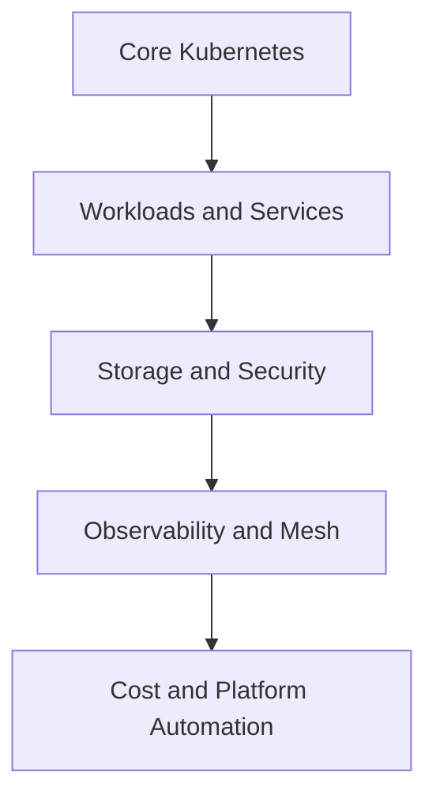

---

## Enterprise Open-Source Tools Reference Matrix

---

*To build a production-grade Kubernetes ecosystem, you must complement the core platform components with these specialized open-source tools:*

| Category | Tool | Production Application & Function |
| --- | --- | --- |
| **Security & Governance** | Trivy | Scans container images, filesystems, and Git repositories for known CVE vulnerabilities and configuration flaws before they enter the cluster. |
|  | Kube-bench | Checks active cluster configuration parameters against the Center for Internet Security (CIS) Kubernetes Benchmarks to identify hardening vulnerabilities. |
|  | Falco | Monitors Linux system calls directly within the kernel layer to provide real-time runtime threat detection and alerting for anomalous container behaviors. |
|  | Tetragon | Uses eBPF to perform real-time security observability and runtime policy enforcement, blocking malicious operations directly within the kernel. |
|  | OPA / Kyverno | Policy enforcement engines that evaluate incoming API requests against custom governance rules (e.g., blocking any container attempting to run as root). |
|  | Terrascan | Static code analysis engine that scans Infrastructure as Code (IaC) files (Terraform, Helm, K8s YAML) to identify security flaws before provisioning. |
| **Configuration & UI** | Kustomize | Native configuration management tool that customizes K8s manifests template-free using overlays to manage variations across environments (Dev, Staging, Prod). |
|  | Helm | The standard package manager for Kubernetes; uses parameter-driven templates to package, version, and distribute complex application manifests. |
|  | k9s | A highly optimized terminal user interface (TUI) providing real-time navigation, logs inspection, and interaction with cluster resources. |
| **Observability & Mesh** | Prometheus | The standard time-series data framework that scrapes, indexes, and alerts on metrics collected from applications and cluster components. |
|  | Jaeger | Distributed tracing platform used to visualize request timelines across microservices to isolate latency bottlenecks and transaction errors. |
|  | Cert-Manager | Automates the complete lifecycle of X.509 TLS certificates, handling automated provisioning, validation, and renewal via integration with ACME providers. |
|  | Envoy | High-performance service proxy utilized as the standardized data plane interface by modern service mesh solutions. |
|  | Istio | Comprehensive Service Mesh solution providing advanced traffic routing controls, strict mTLS network encryption, and rich telemetry data. |
| **Storage & Optimization** | Rook | Storage orchestrator that automates the provisioning, configuration, and lifecycle management of distributed storage platforms (like Ceph) natively within K8s. |
|  | KEDA | Kubernetes Event-driven Autoscaling engine that extends the HPA to scale workloads based on metrics from external sources (e.g., Kafka lag, AWS SQS queues). |
|  | OpenCost | Real-time container-level cost allocation engine that tracks workload resource allocations against cloud provider billing models to map infrastructure spend. |

### How to Use This Matrix
Use this matrix as a map of the Kubernetes ecosystem. The core platform gives you scheduling and orchestration, while the tools in this matrix extend it with security, cost control, storage, and operational visibility.

A practical learning path is:
1. Learn the core Kubernetes primitives first.
2. Add workload management, networking, and storage.
3. Introduce observability and policy tools.
4. Expand into stateful systems, autoscaling, and cost optimization.

### Ecosystem Workflow Diagram

Example:
- A deployment needs scheduling, service exposure, storage, monitoring, and policy checks.
- The tools in the matrix help you cover each layer.

### Quick Summary
- Kubernetes provides the control plane.
- The ecosystem tools extend it with security, storage, monitoring, and cost visibility.
- A production platform usually combines all of these layers together.

---