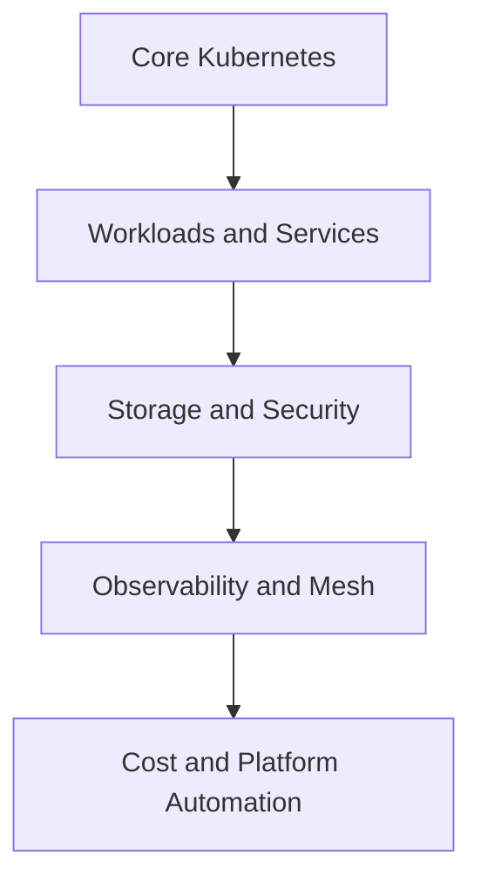

---

## Enterprise Open-Source Tools Reference Matrix

---

*Production Kubernetes is more than just deploying containers. A reliable cluster needs secure images, policy enforcement, observability, storage automation, autoscaling, and cost visibility. The tools below complement the core Kubernetes platform and help teams build a more complete, production-ready environment.*

### Why This Matrix Matters
In real-world environments, Kubernetes alone does not solve every operational challenge. Teams often need to manage:
- security and compliance
- configuration and deployment consistency
- monitoring, tracing, and alerting
- storage and resilience
- autoscaling and cost control

This matrix highlights the most widely used open-source tools that strengthen Kubernetes for enterprise and production use.

| Category | Tool | Production Application & Function |
| --- | --- | --- |
| **Security & Governance** | Trivy | Scans container images, filesystems, and Git repositories for known CVEs and configuration issues before they reach the cluster. |
|  | Kube-bench | Evaluates cluster settings against CIS Kubernetes benchmarks to identify hardening gaps and compliance risks. |
|  | Falco | Detects suspicious behavior at runtime by monitoring kernel-level events and alerting on abnormal container activity. |
|  | Tetragon | Uses eBPF to provide runtime security visibility and enforce policies directly at the kernel level. |
|  | OPA / Kyverno | Enforces organization-specific policies as code, such as preventing privileged containers or enforcing naming standards. |
|  | Terrascan | Analyzes Infrastructure as Code and Kubernetes manifests to find misconfigurations before provisioning or deployment. |
| **Configuration & UI** | Kustomize | Manages environment-specific Kubernetes configurations through overlays without relying on heavy templating. |
|  | Helm | Packages, versions, and deploys complex applications using reusable charts and parameterized templates. |
|  | k9s | Provides a fast terminal-based interface for navigating cluster resources, inspecting logs, and troubleshooting quickly. |
| **Observability & Mesh** | Prometheus | Collects and stores metrics, enabling alerting and performance monitoring across the platform. |
|  | Jaeger | Helps trace requests across distributed services so teams can identify latency and failure points. |
|  | Cert-Manager | Automates the issuance, renewal, and lifecycle management of TLS certificates for Kubernetes workloads. |
|  | Envoy | Acts as a high-performance proxy and data-plane component used by service mesh architectures. |
|  | Istio | Provides service-to-service traffic management, encryption, and observability for modern microservices platforms. |
| **Storage & Optimization** | Rook | Automates the deployment and management of storage systems like Ceph inside Kubernetes. |
|  | KEDA | Extends autoscaling by triggering workloads from external event sources such as queues, streams, or databases. |
|  | OpenCost | Tracks cloud and infrastructure costs at the container and workload level to improve financial visibility. |

### How to Use This Matrix
Think of this matrix as a roadmap for building a mature Kubernetes platform. The core Kubernetes components provide orchestration and scheduling, while the tools in this matrix add the capabilities needed for production operations such as security, reliability, governance, and cost awareness.

A practical learning path is:
1. Start with the core Kubernetes concepts and resource model.
2. Learn workload management, networking, and storage fundamentals.
3. Add security, policy, and compliance controls.
4. Introduce observability tools for metrics, logs, and tracing.
5. Expand into autoscaling, service mesh patterns, and cost optimization.

### Ecosystem Workflow Diagram

### Practical Example
A production deployment typically needs:
- scheduling and service exposure
- persistent storage and backup readiness
- security scanning and policy checks
- monitoring and tracing for diagnosis
- autoscaling and cost awareness

The tools in this matrix help cover each of those layers in a more complete platform design.

### Quick Summary
- Kubernetes provides the control plane and runtime foundation.
- The surrounding ecosystem extends it with security, storage, monitoring, and cost visibility.
- A mature production platform usually combines several of these tools together rather than relying on Kubernetes alone.

---